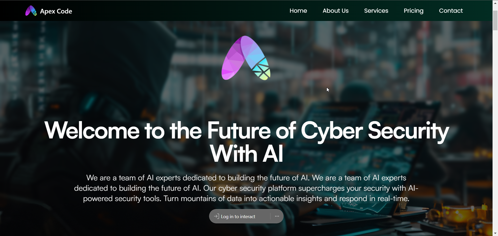
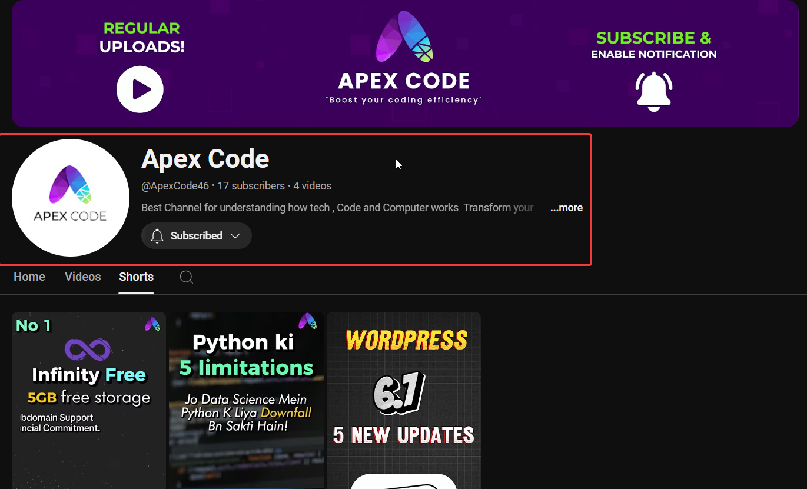

<div align="center">
  
</div>

<div align="center">
  
</div>

# Apex Code - AI-Powered Cybersecurity Platform

<div align="center">

[](https://www.youtube.com/@ApexCode46)
[](https://www.linkedin.com/in/hamza-khan-tanoli-845099205/)
[](https://github.com/yourgithubusername)

</div>

Welcome to the future of cybersecurity with AI. Our platform leverages cutting-edge artificial intelligence to provide robust security solutions for modern challenges.

## 📺 Latest YouTube Tutorials

- [Python Limitations in Data Science](https://www.youtube.com/@ApexCode46)
- [WordPress 6.1 New Updates](https://www.youtube.com/@ApexCode46)
- Check out more tutorials on our [YouTube Channel](https://www.youtube.com/@ApexCode46)

## 🚀 Project Overview

This is a [Next.js](https://nextjs.org) project that implements an AI-powered cybersecurity platform. Our solution helps organizations:
- Transform large datasets into actionable security insights
- Respond to threats in real-time
- Enhance security measures with AI-powered tools
- Streamline security operations

## 🛠️ Getting Started

First, run the development server:

```bash
npm run dev
# or
yarn dev
# or
pnpm dev
# or
bun dev
```

Open [http://localhost:3000](http://localhost:3000) with your browser to see the result.

## 🔧 Tech Stack

- Next.js 14
- TypeScript
- AI/ML Integration
- Real-time Analytics
- Advanced Security Protocols
- Cloud Infrastructure

## 📚 Documentation

To learn more about the technologies used:

- [Next.js Documentation](https://nextjs.org/docs)
- [Learn Next.js](https://nextjs.org/learn)
- [Next.js GitHub Repository](https://github.com/vercel/next.js)

## 🚀 Deployment

Deploy easily using [Vercel](https://vercel.com/new?utm_medium=default-template&filter=next.js&utm_source=create-next-app&utm_campaign=create-next-app-readme).

## 🤝 Connect With Us

- YouTube: [@ApexCode46](https://www.youtube.com/@ApexCode46)
- LinkedIn: [Hamza Khan](https://www.linkedin.com/in/hamza-khan-tanoli-845099205/)
- Regular uploads and tutorials
- Enable notifications to stay updated!

## ⭐ Support

If you find this project helpful, please consider:
- Giving it a star on GitHub
- Following me on GitHub
- Subscribing to my [YouTube channel](https://www.youtube.com/@ApexCode46) for more tutorials

## 📝 License

MIT License - feel free to use this project for your own learning and development!

---
<div align="center">
  <p>Built with ❤️ by Apex Code</p>
  <p>"Boost your coding efficiency"</p>
</div>